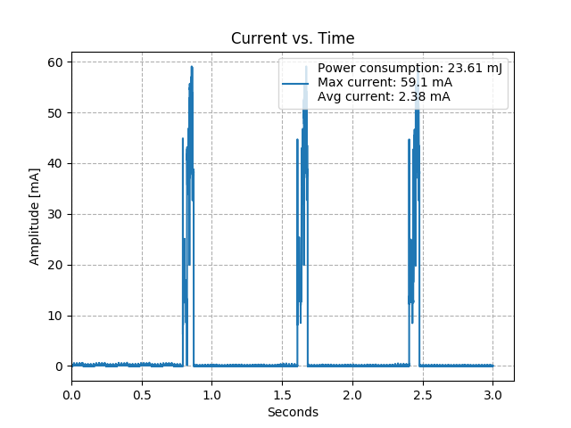

| Supported Targets | ESP32 | ESP32-S2 | ESP32-S3 |
| ----------------- | ----- | -------- | -------- |

# ULP Pulse Counting Example

This example demonstrates how to program the ULP FSM coprocessor to count pulses on an IO while the main CPUs are either running some other code or are in deep sleep. See the README.md file in the upper level 'examples' directory for more information about examples.

ULP program written in assembly can be found across `ulp/pulse_cnt.S` and `ulp/wake_up.S` (demonstrating multiple ULP source files). The build system assembles and links this program, converts it into binary format, and embeds it into the .rodata section of the ESP-IDF application.

At runtime, the main code running on the ESP32 (found in main.c) loads ULP program into the `RTC_SLOW_MEM` memory region using `ulp_load_binary` function. Main code configures the ULP program by setting up values of some variables and then starts it using `ulp_run`. Once the ULP program is started, it runs periodically, with the period set by the main program. The main program enables ULP wakeup source and puts the chip into deep sleep mode.

When the ULP program finds an edge in the input signal, it performs debouncing and increments the variable maintaining the total edge count. Once the edge count reaches certain value (set by the main program), ULP triggers wake up from deep sleep. Note that the ULP program keeps running and monitoring the input signal even when the SoC is woken up.

Upon wakeup, the main program saves total edge count into NVS and returns to deep sleep.

In this example the input signal is connected to GPIO0. Note that this pin was chosen because most development boards have a button connected to it, so the pulses to be counted can be generated by pressing the button. For real world applications this is not a good choice of a pin, because GPIO0 also acts as a bootstrapping pin. To change the pin number, check the ESP32 Chip Pin List document and adjust `gpio_num` and `ulp_io_number` variables in main.c.

In this example, the `CONFIG_BOOTLOADER_SKIP_VALIDATE_IN_DEEP_SLEEP` Kconfig option is used, which allows you to reduce the boot time of the bootloader during waking up from deep sleep. The bootloader stores in rtc memory the address of a running partition and uses it when it wakes up. This example allows you to skip all image checks and speed up the boot.

## Example output

```
Not ULP wakeup, initializing ULP
Entering deep sleep

ULP wakeup, saving pulse count
Read pulse count from NVS:   384
Pulse count from ULP:     5
Wrote updated pulse count to NVS:   389
Entering deep sleep

ULP wakeup, saving pulse count
Read pulse count from NVS:   389
Pulse count from ULP:     5
Wrote updated pulse count to NVS:   394
Entering deep sleep

ULP wakeup, saving pulse count
Read pulse count from NVS:   394
Pulse count from ULP:     6
Wrote updated pulse count to NVS:   400
Entering deep sleep

ULP wakeup, saving pulse count
Read pulse count from NVS:   400
Pulse count from ULP:     5
Wrote updated pulse count to NVS:   405
Entering deep sleep
```

Note that in one case the pulse count captured by the ULP program is 6, even though the `edge_count_to_wake_up` variable is set to 10 by the main program. This shows that the ULP program keeps track of pulses while the main CPUs are starting up, so when pulses are sent rapidly it is possible to register more pulses between wake up and entry into app_main.

With the default configuration (20ms ULP wakeup period), average current consumption in deep sleep mode is 16uA.

## Typical current consumption


